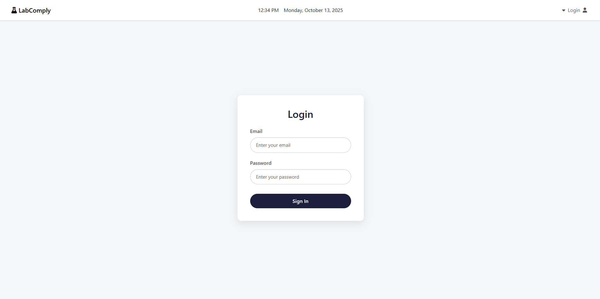

# AI Powered Lab Compliance Monitoring with Display Visualization

## **Prerequisites**
Before getting started, ensure the following:

- **NVIDIA GPU with CUDA support**
    - To check if your GPU is ready run the following commands:<br>
```bash
nvidia-smi
```
```bash
cd modularized
python gpu_check.py
```
(gpu_check.py requires PyTorch library)

  - If not configured, install:
      - [CUDA Toolkit](https://developer.nvidia.com/cuda-toolkit-archive)
      - [cuDNN](https://developer.nvidia.com/rdp/cudnn-archive)
- **Python 3.12+**
- **PostgresQL**
- **(Optional) Docker and Docker Compose**

## **Getting Started (Linux Ubuntu)**
### 1. Create Python Virtual Environment
```bash
python3 -m venv .venv
```
### 2. Activate and Deactivate the environment

```bash
source .venv/bin/activate
deactivate
```

### 3. Install Dependencies from requirements.txt

```bash
cd modularized
pip install -r ./requirements.txt
```
### 4. Env File
Refer to .env.example to create a .env file

### 5. Run the Flask app
```bat
python app.py
```
The app should be accesible at [**http://localhost:5000**](http://localhost:5000)


## **Docker (Optional)**
Using Docker to start the application.

### 1. Env File
Refer to .env.example to create a .env file

### 2. Start containers
```bash
cd modularized
docker compose -f docker-compose.yml up -d
```
The app should be accesible at [**http://localhost:5000**](http://localhost:5000)


