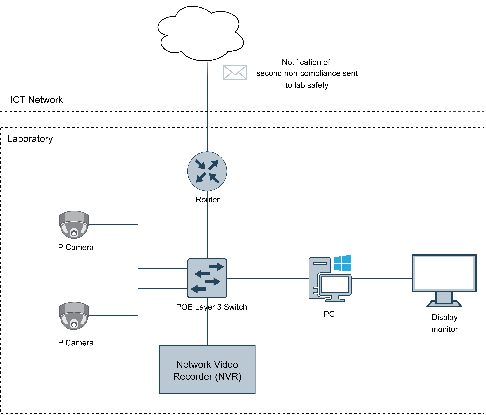

# Overview
This document provides a comprehensive overview of the inner workings of the AI Powered Lab Compliance Monitoring with Display Visualization System.
This system monitors laboratories to detect food or drink consumption, using an AI-driven detection pipeline integrated with an IP camera network. The objective is to automate the detection and evidence-capturing process using surveillance infrastructure and computer vision.

## **Network**
### Hardware Components
| Component                                   | Purpose                                                             |
| --------------------------------------------| ------------------------------------------------------------------- |
| **HikVision IP Cameras**                    | Capture live video feeds from different areas of labs, continuously stream footage using RTSP (Real-Time Streaming Protocol)                             |
| **DeepinMind NVR**                          | Centralized video storage and retrieval system, utilizes facial recognition capabilities to track people who violate rules at least twice                      |
| **PoE Layer 3 Switch**                      | Power over Ethernet for IP cameras                                  |
| **Router** | Connects the local network to the internet, and supports internal communication between devices      |
| **Windows 11 PC**                           | Hosts the detection pipeline and manages processing                 |
| **Display Monitor**                         | Display incompliance images, with timestamp and location            |

## **Logical Architecture**
This diagram represents the logical components of the dashboard and detection components and how they interact to detect/ display incompliances.

## **Detection Pipeline: Step-by-Step**
### 1. Camera Stream Access
Each camera stream is continuosly pulled and read via RTSP protocol, then the frames are submitted to the [Detection Manager](./detection/detection_manager.md).

### 2. YOLO Detction
Detection Manager dispatch the frames to [Detection Workers](./detection/detection_worker.md) using round robin scheduling. The Detection Workers run the YOLO object detection model inference to detect food or drinks.   
If at least 1 food/ drink is detected, it saves a track ID (a unique number per entity given by the model to track objects across frames) as well as bounding box information of the detected food/ drink.   
Another YOLO model is then utilized for pose detection to find any human figures in the frame and saves landmark (wrists, eyes, nose, ears) information of each person.  
If there's at least 1 food/ drink and 1 human figure, it puts the frame into the [Camera's](./camera/camera.md) process_queue.  
Regardless of whether there's a food/ drink or human detection, the frames are also submitted to the display queue of each camera for video feed display on the dashboard.

### 3. Human to Food/ Drink Association
Given the track ID, bounding box info, and landmark info of human figures in the frame, the association() function continuously attempts to associate the most likely owner of each food/ drink present in the frame based on the Euclidean distance between:  
- the nose and wrist landmarks  
- the bounding box of the food/ drink  

The result of this process produces a dictionary of all food/ drinks mapped to the landmarks of the most likely owner.

A person must maintain close wrist proximity to the object for at least 2 seconds before counting as an incompliance. This helps prevent incorrect associations in scenarios where a person briefly passes near a detected item, for example if they are walking past a food/ drink, by ensuring that it does not trigger a detected incompliance.

### 4. Saving Incompliance Snapshots
Once an incompliance is triggered, the face area is cropped and sent to the [NVR](./incompliance/nvr.md) for facial recognition.  
If a match is found on a different date (meaning that the person has at least 1 previous incompliance), the incompliance is logged and the face crop is also saved in the NVR's face database (under the name "Incompliance") for future use.  
If a match is found on the same date, the system will disregard it. This is to prevent the same individual from being detected repeatedly within consecutive frames on the same day, ensuring that only new or distinct incompliances are logged.  
If no match is found, the system will treat the individual as a new person committing the incompliance.