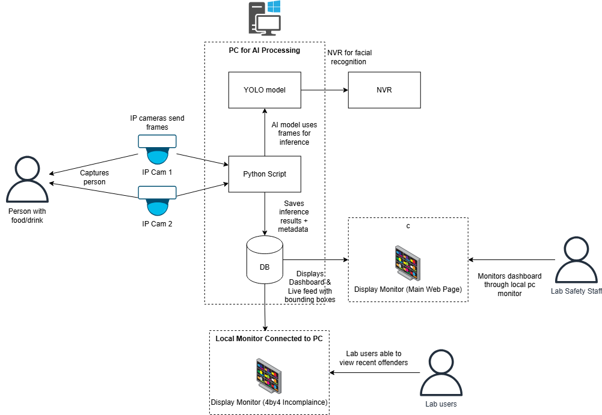
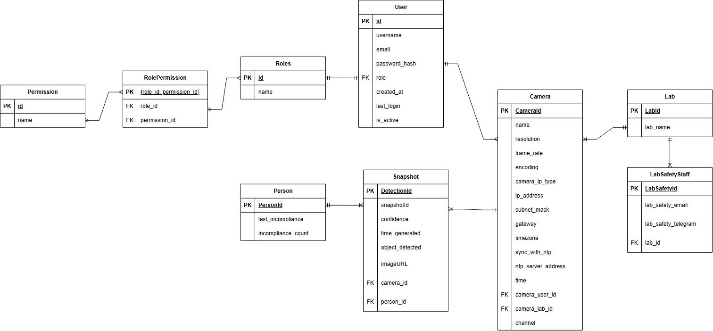
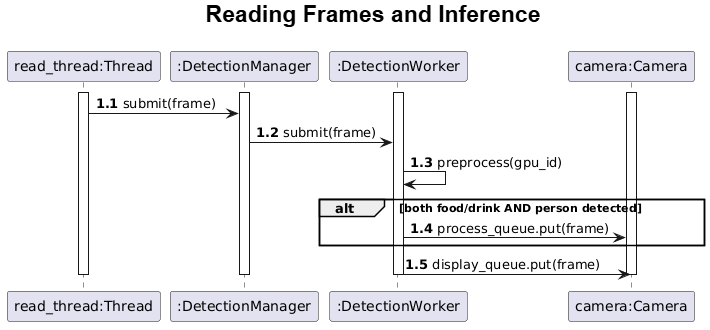
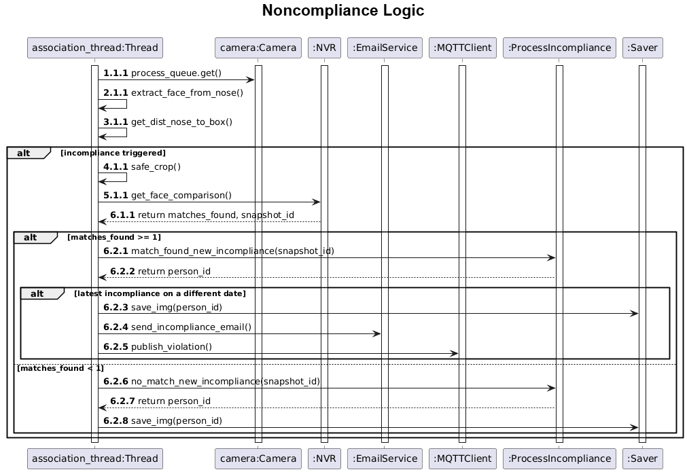

# Overview
## Introduction
This page provides a comprehensive overview of the AI Powered Lab Compliance Monitoring with Display Visualization System.
This system monitors laboratories to detect food or drink consumption, using an AI-driven detection pipeline integrated with an IP camera network. The objective is to automate the detection and evidence-capturing process using surveillance infrastructure and computer vision.

The system works by analyzing footage from the cameras, detecting the presence of any lab users bringing in food or drinks using computer vision models and saving a snapshot of the violation (locally) as well as the offender's face (in the NVR). Upon a repeated violation by the same person, the system will notify the lab safety personnel through the available notification services (currently MQTT and Telegram services are supported).

Authorized users can access the dashboard to obtain the incompliance history as well as other management controls. For the user manual, refer to [User Guide](./user-guide.md)
The display monitor that projects a 4x4 collage of recent incompliances is meant for regular users of the lab, ensuring that they know the environment is being strictly monitored.

## **Network**
This section provides an overview of the hardware required for the system and illustrates the network connections between each component.
### Hardware Components
| Component                                   | Purpose                                                             |
| --------------------------------------------| ------------------------------------------------------------------- |
| **HikVision IP Cameras**                    | Capture live video feeds from different areas of labs, continuously stream footage using RTSP (Real-Time Streaming Protocol)                             |
| **DeepinMind NVR**                          | Centralized video storage and retrieval system, utilizes its facial recognition capabilities to track people who violate rules at least twice                      |
| **PoE Layer 3 Switch**                      | Power over Ethernet for IP cameras                                  |
| **Router** | Connects the local network to the internet, and supports internal communication between devices      |
| **PC**                           | Hosts the detection pipeline and manages processing                 |
| **Display Monitor**                         | Display recent incompliance images to users of the lab              |

## **Tech Stack**
This diagram represents the logical components of the dashboard and detection components and how they interact to detect/ display incompliances.   The incompliance snapshots are being saved under the **./web/static/incompliances** directory while the pretrained model files are placed in the **./yolo_models** file.

## **Database Design**

## **Detection Pipeline: Step-by-Step**
Refer to the flowchart below for an illustration of the detection pipeline.
### **1. Reading Frames from Camera Stream**
Each camera’s video stream is continuosly read via RTSP protocol, then the frames are submitted to the [Detection Manager](shared/detection_manager.md).

### **2. YOLO Detection**
Detection Manager dispatch the frames to [Detection Workers](shared/detection_worker.md) using a _round robin scheduling_ approach. The Detection Workers run the YOLO object detection model inference to detect food or drinks.   
Each Detection Worker runs a YOLO object detection model to check for any visible food or drinks.

- If food or drinks are detected, the system stores:  
    - A unique track ID for each detected item (used to track objects across frames)    

    - Its bounding box information (location in the frame, class ID, confidence)  

- Next, a separate YOLO pose detection model looks for human figures in the same frame.  
    - If people are detected, it saves their landmarks (eyes, nose, ears, and wrists).    

- If at least one food/drink and one person are detected:  
    - The frame is added to the [Camera's](shared/camera.md) processing queue.  

Regardless of detections, all frames are also sent to the dashboard display queue so they can be viewed in the live video feed.

### **3. Matching People to Food/Drinks**
The `association()` function continuously attempts to associate the most likely owner of each food/ drink present in the frame by calculating how close each person’s nose and wrists are to the food/drink bounding box using the Euclidean distance between:  

  - the nose and wrist landmarks  
  
  - the bounding box of the food/ drink  

The closest person is assumed to be the owner.  

To avoid false alarms like someone walking by, the system waits until the person has maintained close wrist proximity for at least 2 seconds before counting it as an incompliance.  

### **4. Saving Incompliance Snapshots**
When an incompliance is confirmed:  
The face area is cropped and sent to the [NVR](threads/nvr.md) for facial recognition.  

- If a **match is found** on a **different date**:
    - This means that the person has at least 1 previous incompliance

    - The incompliance is logged, incompliance details for person updated in datasbase

    - The face crop is saved in the NVR's face database (under the name "Incompliance") for future use

    - Frame pushed to queue in [Saver](threads/saver.md) and saved in web/static/incompliances/

- If a **match is found** on the **same date**:
    - The system will disregard it

    - This is to prevent the same individual from being detected repeatedly within consecutive frames on the same day, ensuring that only new or distinct incompliances are logged  

- If **no match** is found:
    - The system will treat the individual as a new person committing the incompliance 

    - The incompliance is logged, new person created in the database

    - The face crop is saved in the NVR's face database (under the name "Incompliance") for future use

    - Frame pushed to queue in Saver and saved in web/static/incompliances/ 

## **Detection Pipeline Flowchart**

## **Sequence Diagrams**
### **Reading Frames and YOLO Detection Logic**
 
The [Read Thread](threads/reader.md) pulls frames from the camera and submits them to the DetectionManager with that distributes it to one of the DetectionWorker THREAD.
Within the DetectionWorker THREAD, YOLO inference is being done using preprocess(gpu_id). 

The model used for inference can be modified in [DetectionWorker](threads/detection_worker.md).

If at least one food/ beverage AND a human figure is detected within the frame, it is sent to both the camera's processing queue, to match each food/ beverage to the most likely owner,
and its display queue, for the dashboard's video feed. Otherwise, the frame is only sent to the camera's display queue.

### **Noncompliance Logic**
The incompliance logic refers to the behaviour of the system when checking whether the person is a repeated offender. This incompliance processing
happens within the [Assocation thread](threads/association.md), which is after the DetectionWorker's YOLO detection.

An incompliance is triggered when an association between a food/ beverage object and a person is made.
The following is a breakdown of the alternate flows for the incompliance logic.

- **incompliance triggered flow:** Extraction of face, proceeds to facial comparison
    - matches found: means person has previous violation, proceed to check if the latest violation is the same as today's date.
        - same as today's date: meaning that the violation has already been flagged for today, will ignore.
        - different date: meaning that is a new violation, proceed to take a snapshot and save as new incompliance event, **notify lab staff**
    - no matches found: means new violator, proceed to take a snapshot and save as new incompliance event. Does NOT notify lab staff.

- **no incompliance triggered flow:** skips loop

