# User Guide
This page provides a guide on how to use the system from a user's point of view. For a more in-depth rundown of the system, refer to [Overview](./overview.md).<br>

## Adding Labs<br>
Click on **Labs** located at the top navigation bar to access the Labs Management Page.<br>
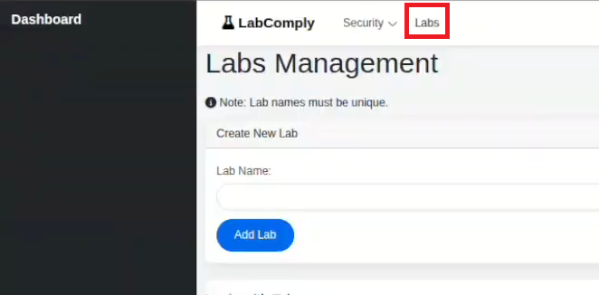

Input a lab name and click on Add Lab. **Lab names are:**

- **Unique**
- **Case sensitive**

Otherwise the system will throw an error.

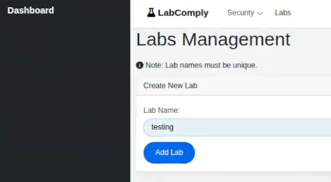<br>

The newly created lab will show up as illustrated below.<br>
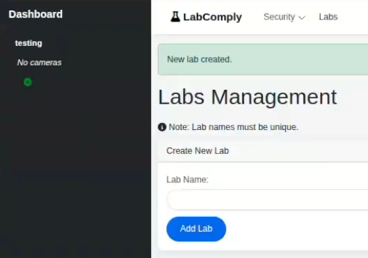

## Adding Cameras<br>
**At least 1 Lab must be added before any cameras can be added.**<br>
Click on the green plus (+) icon on the left hand side menu under the chosen lab.<br>
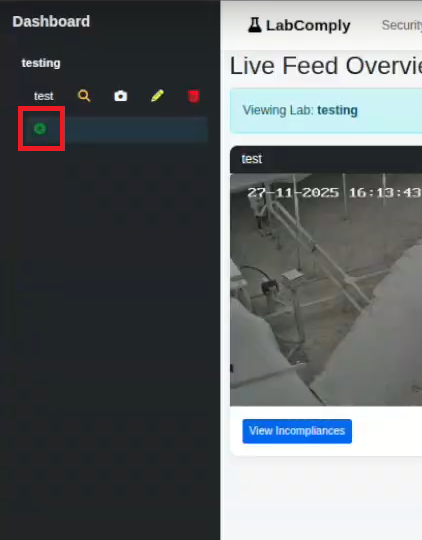<br>

Enter the IP address of the camera. The camera's IP address can be retrieved from the NVR.
The Add Camera button will be disbaled until the IP address has been validated.
Press the search icon 🔍 to validate the IP address of the camera.<br>
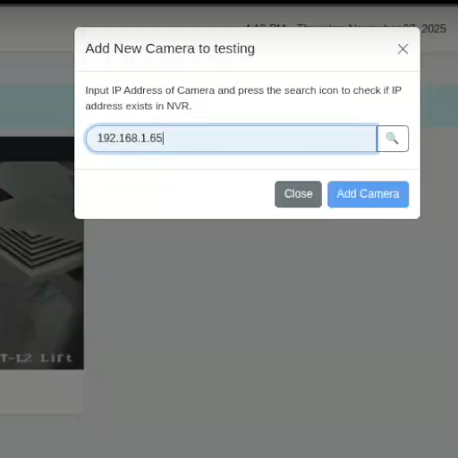<br>

Once the camera is found, the Add Camera button will be enabled. Click on it to finish the process of adding a camera.<br>
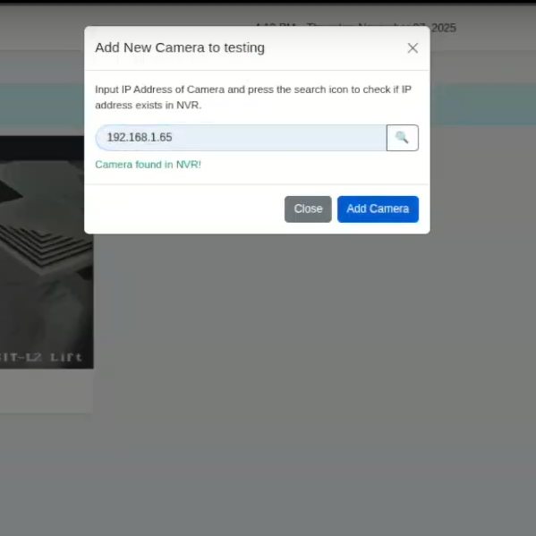<br>

The new camera will be reflected on the left hand side menu and it will be associated to the particular lab it has been added to.<br>
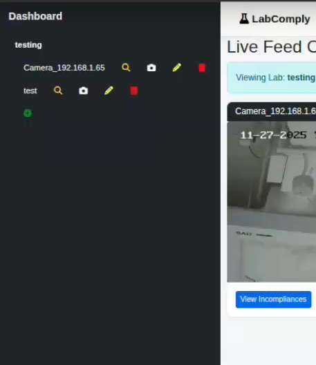<br>


## Removing Cameras
Cameras can be removed by clicking on the red trash bin icon associated to it on the left hand side menu.<br>
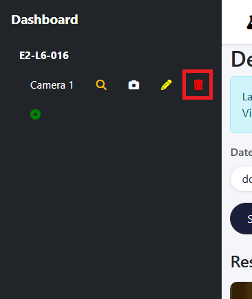

## Creating/ Updating Roles
Access the roles and permissions management page in the top navigation bar under Security > Role Management.


Input a new role name then click on Add Role. **Role names are:**

- **NOT** case sensitive (all names are converted to lowercase)
- **Unique**
Otherwise the system will throw an error.

```In this example a new role called "viewer" is added ```

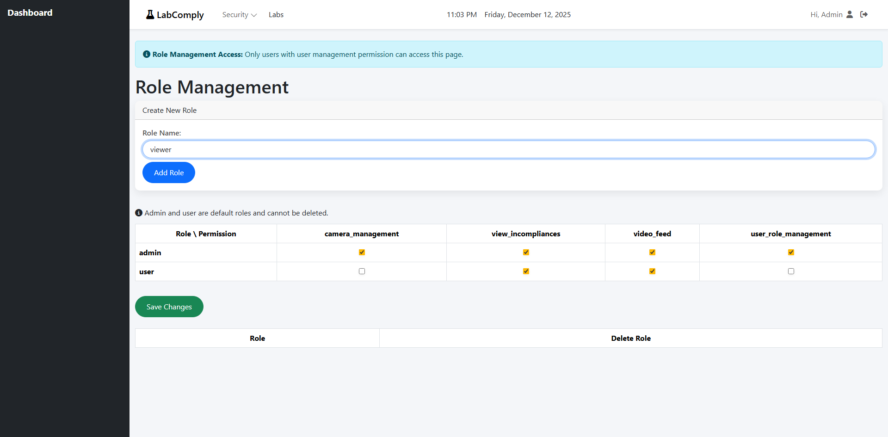

By default, newly created roles have no permissions.
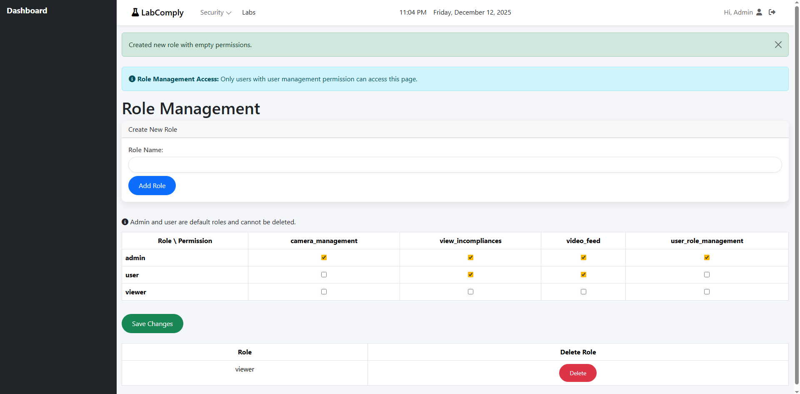

Modify the permissions for the newly created role and save the changes. The permissions available in the system are:

- camera_management: permission to access to all lab and camera actions
- view_incompliances: permission to view incompliances history (snapshots and video footage)
- video_feed: permission to view live feed of cameras (through the camera icon on the left hand side menu)
- user_role_management: permission to modify, create and delete users, roles and permissions for the system

Admin and User roles are default and cannot be deleted. Only custom roles can be deleted.
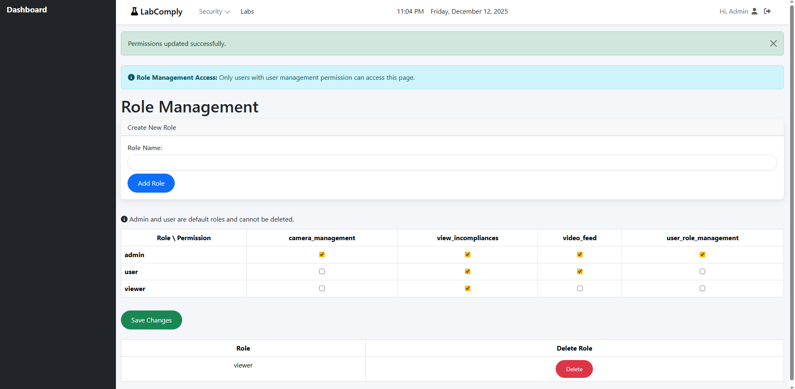

## Creating/ Updating Users
Access the user management page through the top navigation bar under Security > User Management.

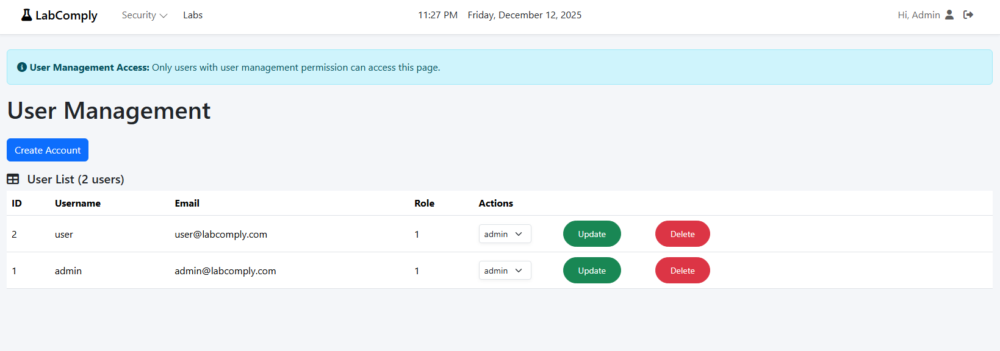

The Role column indicated the account's current role:

- 1: admin
- 2: user
- other roles are indicated by its id

The Action column dropdown indicates the role options available. **This column is not to be mistaken for the account's current role. It just shows all the roles available for one to update.** 
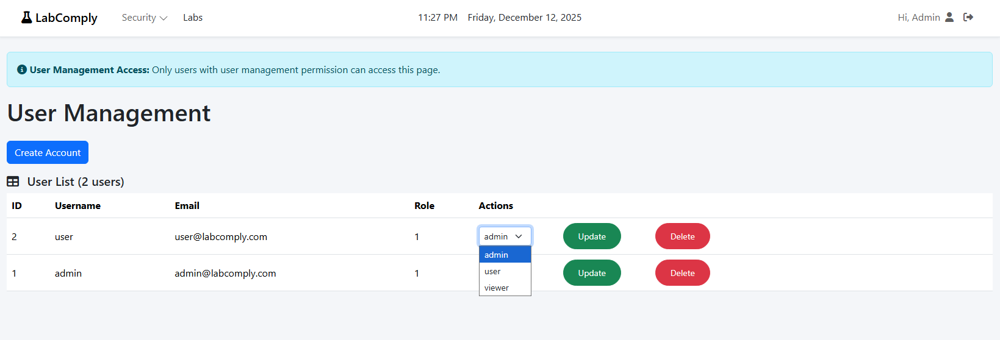

Once a new role is selected in the Action column, clicking Update will save the changes. **The updated role can now be seen under the Role column**
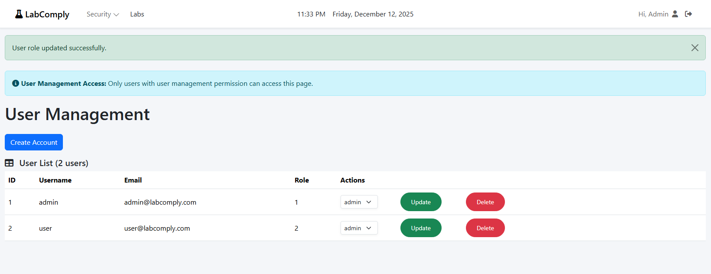


## 4x4 Recent Incompliance Page
Access the 4x4 incompliance display page by appending /latest_incompliance to the URL

```Example: http://127.0.0.1:5000/latest_incompliance```